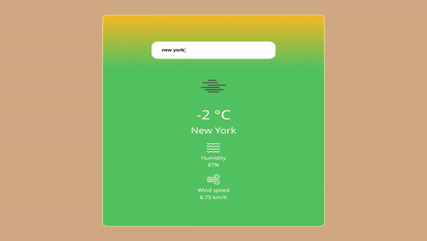

React Weather App
-----------------

"Simple application to check the weather in any city around the world. Thanks to OpenWeatherMap for providing the API to develop this app."

Live here: https://mvt3.github.io/Weather-React/

### Skills used

 <h2>  How it works?  </h2>
 
 
It's as simple as entering the name of the city you want to check, and you're done.

 

